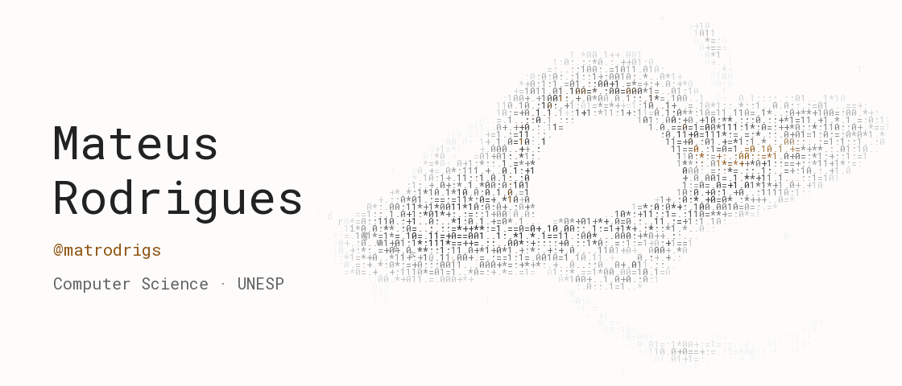

<picture>
  <source media="(prefers-color-scheme: dark)" srcset="assets/field.gif">
  <source media="(prefers-color-scheme: light)" srcset="assets/field-light.gif">
  
</picture>

 

<samp>Computer Science student at UNESP. Driven by curiosity. Exploring ideas through AI and code.</samp>

  

<samp><strong>Selected work</strong></samp>

<a href="https://github.com/matrodrigs/shotcut-mcp"><samp>shotcut-mcp</samp></a> <samp>A transactional MCP server for editing and rendering Shotcut projects.</samp>

<a href="https://github.com/matrodrigs/java-bossfight"><samp>Fúria Botânica</samp></a> <samp>A 2D boss fight built with Java and libGDX.</samp>

<a href="https://github.com/matrodrigs/bcc-unesp"><samp>bcc-unesp</samp></a> <samp>Computer Science coursework, exercises, and projects in Java and C.</samp>

 

<a href="https://github.com/matrodrigs?tab=repositories"><samp>Explore repositories ↗</samp></a>
